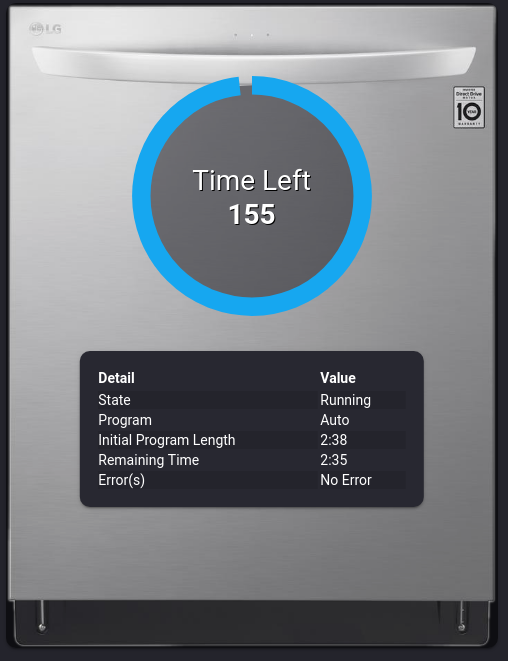

Home Assistant: LG SmartThinQ Component
=======================================

A [Home Assistant][hass] component for controlling/monitoring LG devices
(currently HVAC & Dishwasher) via their SmartThinQ platform, based on
[WideQ][].  The current version of the component requires Home Assistant 0.96
or later.

[hass]: https://home-assistant.io
[wideq]: https://github.com/sampsyo/wideq

Here's how to use this:

1. Clone this repository into your `~/.homeassistant` directory under `custom_components` and name it `smartthinq`. For example, you might do something like this:

       $ cd ~/.homeassistant
       $ mkdir custom_components
       $ cd custom_components
       $ git clone https://github.com/sampsyo/hass-smartthinq.git smartthinq

2. Navigate to the [WideQ][] directory. You can either use the copy installed by Home Assistant, or clone it separately by typing something like:

       $ git clone https://github.com/sampsyo/wideq.git
       $ cd wideq

   Authenticate with the SmartThinQ service to get a refresh token by running the WideQ example script. (Eventually, I would like to add a feature to the Home Assistant component that can let you log in through a UI, but I haven't gotten there yet.) Run this in the `wideq` directory:

       $ python3 example.py -c US -l en-US

   For the `-c` and `-l` parameters, use your country and language code: SmartThinQ accounts are associated with a specific locale, so be sure to use the country you originally created your account with.
   The script will ask you to open a browser, log in, and then paste the URL you're redirected to. It will then write a JSON file called `wideq_state.json`.

   Look inside this file for a key called `"refresh_token"` and copy the value.

3. Add a stanza to your Home Assistant `configuration.yaml` like this:

       smartthinq:
           token: [YOUR_TOKEN_HERE]
           region: US [OPTIONAL]
           language: en-US [OPTIONAL]

   Use your refresh token and country & language codes.
   Start up Home Assistant and hope for the best.

   **NOTE**: Direct use of configuration as part of the climate platform is deprecated.

Dishwasher Visualization Example
--------------------------------

Dishwashers will be automatically added as a new `sensor.lg_dishwasher.[id]`
entity with various useful attributes. See the below example for how this can
be used in the Lovelace UI, which uses the built-in picture-elements card, the
[circle custom card](https://github.com/custom-cards/circle-sensor-card)
and [entity attributes
card](https://github.com/custom-cards/entity-attributes-card).

Credits
-------

This is by [Adrian Sampson][adrian]. The license is [MIT][].

[adrian]: http://www.cs.cornell.edu/~asampson/
[mit]: https://opensource.org/licenses/MIT
